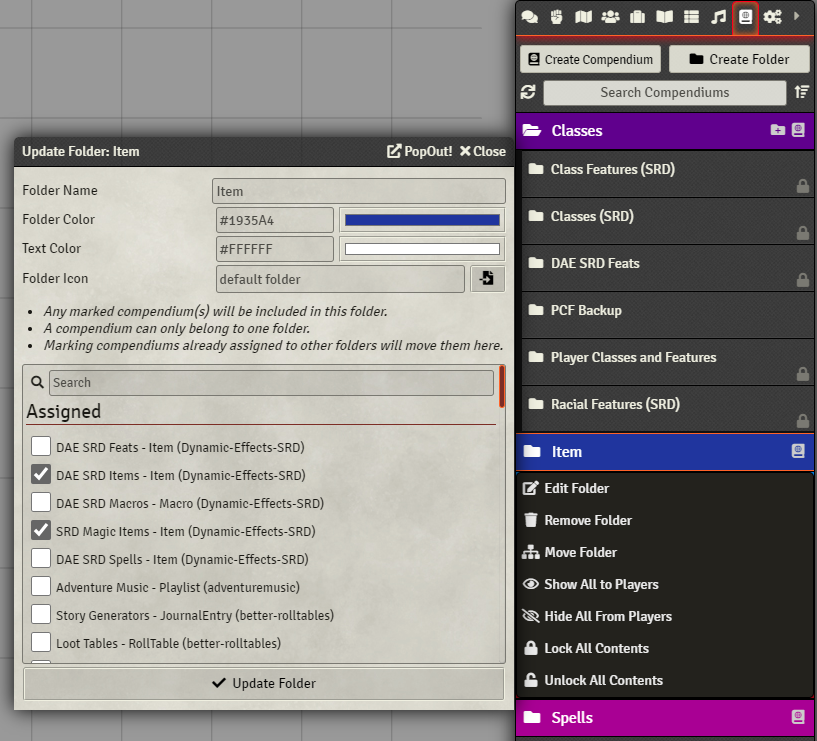

# Compendium Folders

      

This is a module for FoundryVTT which allows you to manage compendiums a bit easier by implementing a folder system. This folder structure can be used to organize compendiums in the directory, in addition to organize entries *inside* compendiums.

The module functionality is split into 2 parts. **Folders In Compendiums** (or **FIC**), and **Folders For Compendiums** (or **FFC**)

## Folders In Compendiums

_This feature only works for FVTT 0.7.3+_

A module that works GREAT with this is [__MoarFolders__](https://foundryvtt.com/packages/moar-folders/). I recommend installing this if you don't have it already.

Export             | Import
:-------------------------:|:-------------------------:
 |  

#### Features
- Entity folder structure import/export into compendiums.
- Folders in the most recently opened compendium with save their open state, so you can easily delete entries within them without having to open everything up.
- Folders in the compendium with no entities within them (e.g a folder with only folders in it), will always be open.
- Supports all entity types (Actor,Item,JournalEntry,Scene,Rolltable)
- Delete Folders inside the compendium (which move all entries up into the parent folder), or Delete All (which deletes the folder and all entries inside it)
- Edit the name and colour of the folder.
- Create new folders and drag/drop entries between them

#### Instructions
- To use the new functionality, each folder has a new right click context menu option named *Export Folder Structure*. This will open up a prompt to pick an unlocked compendium to export to. Once you do, the folder structure will appear in the compendium you picked.
- To import the folders from a compendium, there is a similar button for each folder. This will import the folder structure you have stored into your current world, in addition to creating entities and adding them to the correct folders.
- As of v2.0.8 you can now create folders in compendiums that have folders already in them. Next to the search bar there is a button to Create Folder at Root, and next to each rendered folder there is a similar Create Subfolder button to what you will see in the core application.
- If you dont have any folders in the current compendium, you wont be able to make use of this functionality. To fix this you can export an empty folder into the compendium, then the folder create buttons will appear.

#### Future
- ~~Fix search bar not repopulating when you view a compendium entry~~ Now in 2.0.2!
- ~~Merge-by-name tickbox on Import process~~ Now in 2.0.7!
- ~~Fix path separator so folders containing slashes `/` can be used~~ Fixed in 2.1.4!
- ~~Create folder in compendium?~~ Now in 2.0.8!
- ~~Drag+drop folders into eachother~~ Now in 2.2.0!
- Auto-create folders based on attributes of entries in compendium
- Custom ordering for folders
- More accessible ways to manipulate folders in compendiums via macros/code

## Folders for Compendiums

#### Instructions
Once the module initially runs, it will convert your existing submenus into folders.
Each folder looks like the other directories, having a Create Subfolder button, and Create Compendium button. They also have extra options if you right click them
- The Edit Folder option allows you to edit folder attributes (such as name, color, icon), and assign compendiums to the folder. The compendiums are grouped by Assigned (already in folders) and Unassigned (not in folders). You can also Delete a folder through this dialog, which will delete all child folders and move all compendiums within to Unassigned 
- The Move Folder option allows you to move a folder to another location, also bringing it's children.
- The Show All/Hide All options allow you to toggle visibility of all compendiums within the folder (hiding them from players)
- The Lock/Unlock All options allow you to toggle edit lock on all compendiums within the folder.

There is also an extra context option for compendiums - Hide from GM. This will add the compendium to a hidden folder, hiding it from the GM's view. 
- You can make the compendium visible again by editing a folder and assigning it to the folder.

You can also import and export your folder configuration, to share with others or to backup your folder structure. In the Settings tab under Compendium Folders you can find an Import/Export dialog. Pasting someone elses Import string into the import box will seamlessly import their folder structure, ignoring any missing compendiums.

I would recommend once you are happy with your layout, to save your folder configuration. This will also be useful if you are going to submit an issue or bug on GitHub.

#### Future

1. ~~Move compendiums between folders~~ Now in 0.1.4!
2. ~~Create/Rename/Update/Delete folders~~ Now in 0.1.4!
3. ~~Nesting folders + Moving folders around~~ Now in 1.0.0
4. ~~Seach, collapse all, and refresh (like other tabs)~~ Now in 0.1.7!
5. ~~Import/Export folder configuration~~ Now in 1.0.0!
6. Custom folder ordering (currently defaults to alphabetical)
7. ~~Default folder for new compendiums~~
8. ~~Default open/close state for folders~~
9. ~~Custom folder and icon text color~~ Now in 1.0.6!
10. ~~Drag/Drop functionality~~ Now in 2.0.0!
11. ~~Context menu right-click instead of buttons on the folder when open.~~ Now in 2.2.0!

Any issues feel free to ping me on Discord (@Erceron#0370)

## Localization
Special thanks to the translators who contributed to this project:
- lozalojo (Spanish)
- CarnVanBeck (German)
- rinnocent (Brazilian Portugese)
- Himeroos#4803 (French)
- xdy (Swedish)
- BrotherSharper (Japanese)

## Contribution
If you'd like to support my work, feel free to buy me a coffee at [my kofi](https://ko-fi.com/erceron)

---

This project is licensed under the CC-BY-NC license. Visit https://creativecommons.org/licenses/by-nc/4.0/ for more information.
